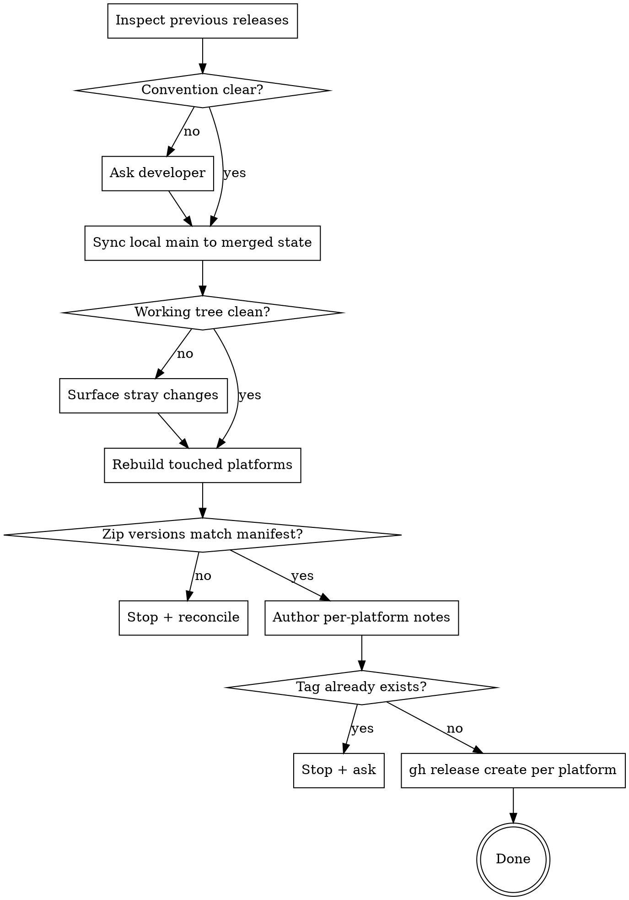

# ti-create-release

## Overview

Titanium native modules ship as platform-specific zip files (one per platform). Releasing means: read the repo's historical release pattern, rebuild from the merged default branch so the artefact matches the released code, and call `gh release create` once per platform with the matching zip attached.

**Core principle:** never publish a release whose artefact wasn't built from the exact commit you tag.

## When to Use

Use this skill when:
- A merged PR lands changes worth shipping (often after running `/ti-module-update`)
- The user says "create a release", "cut a release", "tag a release", "publish the module", "attach the zip"
- A module zip needs to be uploaded to GitHub releases

Do NOT use for:
- App releases (App Store / Play Store) — different workflow
- Tagging without an artefact (use plain `git tag` + `gh release create` without an asset)
- Re-publishing an existing release (use `gh release upload <tag> <file> --clobber` to update assets in place)

## Workflow



## Step 1 — Inspect Historical Releases

Pick the convention from what's already in the repo. Don't invent one.

```bash
SLUG=$(gh repo view --json nameWithOwner --jq .nameWithOwner)
gh release list --repo "$SLUG" --limit 10
gh release view <last-platform-tag> --repo "$SLUG" --json name,tagName,body,assets
```

Note four things:

| Aspect | Common patterns |
|---|---|
| **Tag** | `<platform>-<version>` (e.g. `ios-16.0.0`, `android-15.0.0`) — most common. Alternative: `v<version>-<platform>` (e.g. `v14.0.0-android`). |
| **Display name** | `iOS X.Y.Z` / `Android X.Y.Z` |
| **Body style** | Brief markdown checklist; sometimes auto-generated PR list |
| **Asset filename** | Always `<moduleid>-<platform>-<version>.zip` produced by `ti build` (e.g. `facebook-iphone-16.0.0.zip`, `facebook-android-15.0.0.zip`) — `iphone`, not `ios`, on Apple side |

If recent history is mixed (one anomalous tag, several others differ), follow the dominant pattern. If it's genuinely ambiguous, **stop and ask** before tagging.

## Step 2 — Sync Local Repo to the Merged State

A release must be built from exactly what's on the default branch. Never release from a feature branch or a dirty tree.

```bash
git fetch origin
git checkout master   # or main — match the repo's default
git pull
git status
git log --oneline -5
```

If the working tree is dirty, treat it as a flag rather than something to commit. Benign autodriff (e.g. husky migration in `package.json`) can be ignored — it doesn't enter the build. Real changes mean the developer isn't actually ready to release; surface them and stop.

## Step 3 — Rebuild Each Platform You're Releasing

From the per-platform directory, in parallel (separate dist dirs so they don't conflict):

```bash
cd ios     && ti build -p ios --build-only
cd android && ti build -p android --build-only
```

`--build-only` still produces the dist zip — it just skips device install. The build writes `<platform>/dist/<moduleid>-<platform>-<version>.zip`, where `<version>` is read from `<platform>/manifest`'s `version:` line.

If a platform build fails, **stop**. Never ship a partial release where one platform is the new version and the other is stale.

## Step 4 — Verify the Zip Matches the Manifest

```bash
ls -lh ios/dist/*.zip android/dist/*.zip
grep ^version: ios/manifest android/manifest
```

The zip's version segment must equal the manifest's `version:`. If they disagree:
- Build picked up an older manifest, or
- Manifest hasn't been bumped for this release.

Stop and reconcile before tagging.

## Step 5 — Author Per-Platform Release Notes

One release per platform — never combine. Mirror the repo's historical body style. The most common Titanium-module style is a short checkbox list, ending with a PR link:

```markdown
- [x] Update Facebook iOS SDK to 18.0.3
- [x] Bump Titanium SDK pin to 13.2.0.GA (`minsdk` 13.0.0)
- [x] Add `advertiserTrackingEnabled` property to opt back into classic login after ATT

See #<PR> for details.
```

Rules:
- Keep each line tight — the long-form story lives in the merged PR.
- Lead lines with `- [x]` for visual continuity with prior releases (everything is "done" by definition).
- Reference the merged PR with `#<number>` so reviewers can click through.
- Don't repeat the platform name in every bullet — the release title already says `iOS X.Y.Z` or `Android X.Y.Z`.
- Per-platform notes only mention that platform's changes. If the PR also touched the other platform, omit those bullets here.

## Step 6 — Create the Release with the Zip Attached

```bash
gh release create <tag> \
  --repo "$SLUG" \
  --title "<Display Name X.Y.Z>" \
  --target master \
  --notes "$(cat <<'EOF'
- [x] <bullet 1>
- [x] <bullet 2>

See #<PR> for details.
EOF
)" \
  <platform>/dist/<moduleid>-<platform>-<version>.zip
```

Run once per platform (so iOS + Android = two `gh release create` invocations).

Notes:
- `gh release create` returns the release URL on stdout — capture and report it.
- `--target master` (or `main`) is explicit; default behaviour follows the repo's default branch.
- Don't pass `--prerelease` unless the version itself flags as such (`-beta`, `-rc`, etc.).
- Don't pass `--latest`; let GitHub track latest by date automatically.
- If the tag already exists, `gh` errors out — **stop and ask the developer**, don't `git tag -f` your way through.

## Quick Reference

| What | Command / Path |
|---|---|
| Repo slug | `gh repo view --json nameWithOwner --jq .nameWithOwner` |
| Recent releases | `gh release list --repo <slug> --limit 10` |
| Inspect prior release | `gh release view <tag> --repo <slug> --json name,tagName,body,assets` |
| Sync local | `git fetch && git checkout master && git pull` |
| Build iOS | `cd ios && ti build -p ios --build-only` |
| Build Android | `cd android && ti build -p android --build-only` |
| iOS zip path | `ios/dist/<moduleid>-iphone-<version>.zip` |
| Android zip path | `android/dist/<moduleid>-android-<version>.zip` |
| iOS tag (typical) | `ios-<version>` |
| Android tag (typical) | `android-<version>` |
| Create release | `gh release create <tag> --title "..." --target master --notes "..." <zip>` |
| Update asset on existing release | `gh release upload <tag> <zip> --clobber` |

## Common Mistakes

- **Releasing from a dirty / not-yet-pushed working tree.** Always sync to the merged state on origin's default branch first.
- **Combining iOS + Android into a single release.** Asset names and consumer flows differ; one release per platform.
- **Inventing a tag pattern.** Mirror the historical pattern exactly; don't introduce a new one without explicit developer agreement.
- **Tagging from a feature branch's `HEAD`.** The release should reflect what's on the default branch, not what's still in PR.
- **Overwriting an existing tag.** If `gh release create` says the tag already exists, stop and ask — don't `git tag -f` your way through.
- **Forgetting to attach the zip.** Notes are useless without the artefact. Always pass the zip path as the positional argument to `gh release create`.
- **Trusting a stale `dist/` zip.** Rebuild explicitly before uploading; never assume yesterday's zip is current.
- **Mismatched zip and manifest versions.** If `ls dist/` and `grep version: manifest` disagree, stop.

## When to Hand Back to the Developer

Stop and ask for explicit feedback when:
- Historical release pattern is mixed and ambiguous
- The tag you'd use already exists on the remote
- The working tree on the default branch is unexpectedly dirty
- A platform build fails — fix the build first; never publish a partial release
- Zip version doesn't match the manifest after a fresh build
- Version straddles a major boundary and you're unsure whether to mark `--prerelease`

When asking, include: the proposed tag, the proposed title, the body draft, and the exact ambiguity you need resolved.
