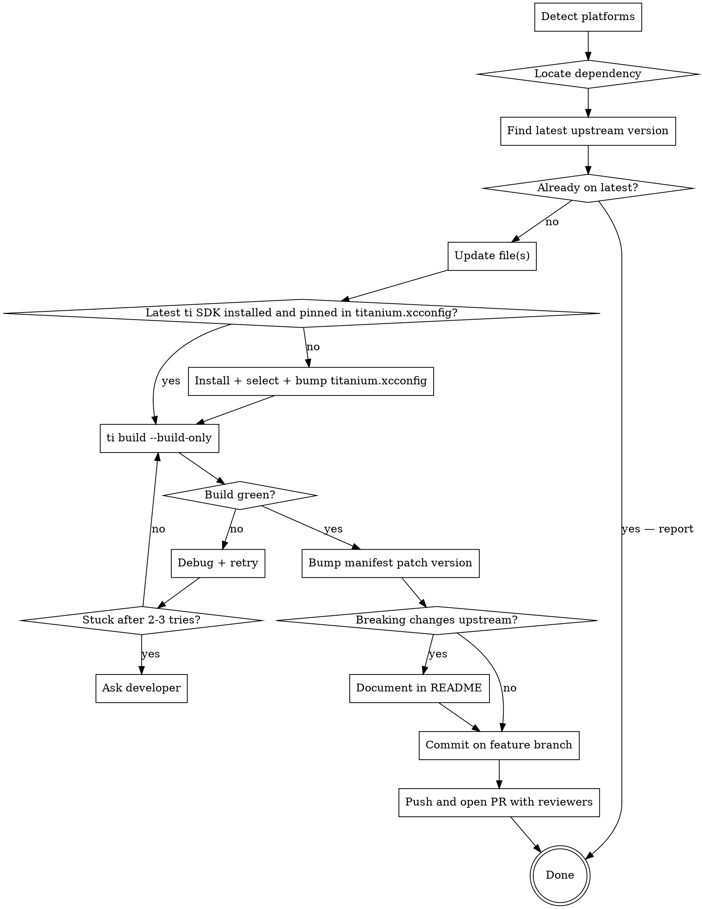

# ti-module-update

## Overview

Titanium native modules wrap an iOS and/or Android SDK and expose it to JS. Updating one means: figure out which platforms the module supports, locate the third-party dependency, find the newest upstream version, update the right file(s), confirm the module still builds with `ti build --build-only` on every affected platform, document any breaking changes in the README, and open a PR from a `feature/update-native-sdk-YYYY-MM-DD` branch with the last two active maintainers as reviewers.

**Core principle:** never ship an updated dependency without a successful `ti build --build-only` on every platform you touched, and never land it without code review.

## When to Use

Use this skill when:
- The user says "update", "upgrade", or "bump" a Titanium module's SDK / dependency
- A repo contains `ios/manifest`, `android/manifest`, or `timodule.xml` and a third-party dep needs refreshing
- A vendor (Facebook, Stripe, Clerk, etc.) released a new SDK and the wrapper module needs to catch up

Do NOT use for:
- Updating Titanium SDK version itself (different workflow)
- Updating JS-only dependencies in `package.json`
- Authoring a brand-new module from scratch

## Workflow



## Step 1 — Detect Platforms

Look at the module root:

| File / Dir present | Platform |
|---|---|
| `ios/` with `ios/manifest` | iOS |
| `android/` with `android/manifest` | Android |
| Both | Both — repeat the workflow per platform |

Quick check:
```bash
ls -d ios android 2>/dev/null
```

## Step 2 — Locate the Dependency

### iOS

Check in this order — the first one that matches is where the dependency lives:

1. **`ios/spm.json`** — Swift Package Manager (preferred when present)
2. **`ios/platform/*.xcframework`** or **`ios/platform/*.framework`** — vendored binary
3. **CocoaPods** (`ios/Podfile` / `Podfile.lock` in some older modules) — rare; treat like SPM but edit Podfile
4. **Source-only** — no third-party dep; nothing to update

```bash
ls ios/spm.json 2>/dev/null
ls ios/platform 2>/dev/null
```

### Android

Open `android/build.gradle` and look for `implementation '...'` lines under `dependencies { }`:

```gradle
dependencies {
    // https://github.com/<vendor>/<sdk-repo>/releases
    implementation '<groupId>:<artifactId>:<version>'
}
```

The Maven coordinate is `groupId:artifactId:version`. The version is what gets bumped.

If `dependencies { }` is empty or missing, there is no third-party dep.

## Step 3 — Find the Latest Version

Sources, in priority order:

1. **The vendor's official developer site / SDK changelog** — authoritative on what's "supported"
2. **GitHub releases** for the upstream repo — most reliable for "what's actually shipped":
   ```bash
   gh release list --repo <owner>/<repo> --limit 5
   gh release view --repo <owner>/<repo>   # latest
   ```
3. **Maven Central** for Android: `https://search.maven.org/artifact/<groupId>/<artifactId>` — for cross-checking versions and confirming the artifact still exists
4. **WebFetch** the vendor's release notes page if `gh` doesn't help

Compare against the version currently in the module. If equal, stop and report — nothing to do.

When checking, also note whether the new version requires a higher minimum iOS / Android SDK or a higher Titanium SDK API version (`apiversion` in the manifest). Surface that to the developer rather than silently bumping platform mins.

## Step 4 — Update the Files

### iOS — vendored .xcframework / .framework

Deps live in `ios/platform/` as one or more `.xcframework` (or older `.framework`) directories.

1. Download the vendor's new release archive (usually a zip on GitHub releases or the vendor's CDN).
2. Unpack it.
3. Replace the existing `.xcframework` directories in `ios/platform/` — delete the old ones first, then copy in the new ones with identical names.
4. If the vendor renamed/added/removed frameworks, update `ios/module.xcconfig` and `ios/titanium.xcconfig` (look for `OTHER_LDFLAGS` / framework search paths) accordingly.

```bash
# typical pattern
curl -L -o /tmp/sdk.zip <download-url>
unzip /tmp/sdk.zip -d /tmp/sdk
rm -rf ios/platform/<OldName>.xcframework
cp -R /tmp/sdk/<NewName>.xcframework ios/platform/
```

**Migrating to SPM:** only do this if the vendor stops shipping `.xcframework` / `.framework` archives. Don't migrate just because SPM is available — keep the existing delivery method.

### iOS — `ios/spm.json`

Format (real example):

```json
{
  "dependencies": [
    {
      "remotePackageReference": "clerk-ios",
      "repositoryURL": "https://github.com/clerk/clerk-ios",
      "requirementKind": "upToNextMajorVersion",
      "requirementMinimumVersion": "1.0.2",
      "products": [
        { "productName": "ClerkKit",   "frameworkName": "ClerkKit",   "linkage": "host" },
        { "productName": "ClerkKitUI", "frameworkName": "ClerkKitUI", "linkage": "host" }
      ]
    }
  ]
}
```

To bump: edit `requirementMinimumVersion`. If the new release is across a major boundary, also reconsider `requirementKind` (`exactVersion`, `upToNextMajorVersion`, `upToNextMinorVersion`, `range`).

### Android — `android/build.gradle`

Edit the version segment of the Maven coordinate:

```diff
- implementation '<groupId>:<artifactId>:<old-version>'
+ implementation '<groupId>:<artifactId>:<new-version>'
```

If the new SDK requires a higher `compileSdkVersion` / `minSdkVersion`, those usually live in the Titanium SDK's gradle templates rather than `android/build.gradle`. Surface the requirement; don't try to override it locally.

## Step 5 — Use the Latest Titanium SDK

Always build against the latest stable Titanium SDK release. The build resolves the SDK from `ios/titanium.xcconfig` (iOS) and the active CLI selection (Android), so both must point at the same version.

1. Find the latest released SDK via the GitHub API:
   ```bash
   LATEST_TI_SDK=$(gh api repos/tidev/titanium-sdk/releases/latest --jq .tag_name)
   echo "$LATEST_TI_SDK"
   # e.g. 13_2_0_GA  →  use as 13.2.0.GA
   ```
   Tags use underscores (`12_5_1_GA`); the version string used elsewhere is the dotted form (`12.5.1.GA`). Convert with `${LATEST_TI_SDK//_/.}` if needed. If the API returns a pre-release, fall back to `gh api repos/tidev/titanium-sdk/releases --jq '.[] | select(.prerelease==false) | .tag_name' | head -n1`.

2. Check whether it's already installed locally:
   ```bash
   ti sdk list | grep "$LATEST_TI_SDK"
   ```

3. Install if missing:
   ```bash
   ti sdk install "$LATEST_TI_SDK"
   ```

4. Select it as active so `ti build` picks it up:
   ```bash
   ti sdk select "$LATEST_TI_SDK"
   ```

5. **iOS only:** update the `TITANIUM_SDK_VERSION` line in `ios/titanium.xcconfig` to the same version. The `TITANIUM_SDK` path below it derives from `$(TITANIUM_SDK_VERSION)`, so only the version line needs editing:
   ```diff
   - TITANIUM_SDK_VERSION = 11.1.1.GA
   + TITANIUM_SDK_VERSION = 13.2.0.GA
   ```

6. Sanity-check the module's `minsdk:` (in `ios/manifest` / `android/manifest`): if it's already higher than the latest SDK, something is wrong upstream — stop and report. If it's much lower than the new SDK, leave it alone unless the dependency update specifically requires raising it.

## Step 6 — Build to Verify

Run the build for every platform you touched. From the module root:

```bash
ti build -p ios --build-only
ti build -p android --build-only
```

Treat the build as the test. A green build is the only signal that the update is safe to commit.

## Step 7 — Debug Build Failures

Common failure modes and where to look:

| Symptom | Likely cause | Fix |
|---|---|---|
| Undefined symbol / missing framework | Vendor renamed / split a framework | Check new release notes; add the new framework to `ios/platform` and update `module.xcconfig` |
| `Module 'X' not found` (iOS) | Header search path or framework search path stale | Update `ios/titanium.xcconfig` / `ios/module.xcconfig` |
| Swift / API deprecation errors | New SDK requires higher iOS deployment target | Check `ios/manifest` `minsdk` and `ios/titanium.xcconfig` `IPHONEOS_DEPLOYMENT_TARGET`; surface to developer before bumping |
| Gradle: `Could not find <coordinate>` | Wrong artifact / typo / removed from Maven | Re-verify on Maven Central; vendor may have moved groupId |
| Gradle: AAPT / resource conflicts | New Android SDK pulls a transitive dep with conflicting resources | Add `exclude group: '...'` or align versions in `android/build.gradle` |
| Gradle: `compileSdkVersion` too low | New SDK requires newer Android compile SDK | Surface requirement; check Titanium SDK version in use |
| iOS build hangs / cache issues | Stale derived data | `rm -rf ~/Library/Developer/Xcode/DerivedData` and retry once |

After 2–3 unsuccessful debug attempts, **stop and ask the developer for explicit feedback** — describe what you tried, the exact error, and the hypothesis you can't verify. Don't spiral.

Use `superpowers:systematic-debugging` for any non-trivial failure rather than guessing.

## Step 8 — Bump Manifest Version (after green build)

On a successful build, bump the patch version in the manifest of every platform you touched:

- `ios/manifest`: `version: 15.0.0` → `version: 15.0.1`
- `android/manifest`: `version: 14.0.0` → `version: 14.0.1`

That's the only line to change. Do not touch `apiversion`, `guid`, `moduleid`, `minsdk` unless the dependency update genuinely requires it — in which case call it out explicitly to the developer.

## Step 9 — Document Breaking Changes in the README

Scan the upstream release notes between the old and new version (already gathered in Step 3) for breaking changes. If there are any, add an entry to the project's `README.md`. If the upstream changelog is clean (fixes / additions only), **skip this step** — don't pad the README.

What counts as breaking:
- Removed / renamed APIs, classes, methods, or symbols consumers may use
- Changed method signatures or default behavior
- Required migration steps for consumers (Info.plist keys, AndroidManifest entries, new permissions)
- Higher minimum platform target (`IPHONEOS_DEPLOYMENT_TARGET`, Android `compileSdkVersion` / `minSdkVersion`)
- Required Titanium SDK / `apiversion` bump

Where in the README:
1. Look for an existing `## Changelog`, `## Release notes`, `## Breaking changes`, `## Migration`, or `## Upgrading` section. Append under the most appropriate heading with a new subheading for the new module version.
2. If no such section exists, add a `## Breaking changes` section near the top, above install instructions.

Format suggestion:

```markdown
### vX.Y.Z — <SDK name> <new-version>

- **Breaking:** <description of what changed for consumers>
- <required migration step, if any>

Upstream release notes: <link>
```

## Step 10 — Commit on a Feature Branch

Create a new branch named `feature/update-native-sdk-YYYY-MM-DD` (UTC date) and commit the dependency bump along with any README changes:

```bash
DATE=$(date -u +%Y-%m-%d)
BRANCH="feature/update-native-sdk-${DATE}"
git checkout -b "$BRANCH"

# stage only what actually changed — trim this list to fit the platforms you touched
git add ios/platform ios/spm.json ios/manifest \
        android/build.gradle android/manifest \
        README.md

git commit -m "Update <SDK name> to <new-version>"
```

Commit message rules:
- Single-line summary: `Update <SDK> to <new-version>`
- If both platforms are bumped in one commit: `Update <SDK> (iOS <v1>, Android <v2>)`
- If breaking changes exist, add a body line: `BREAKING: <one-liner>`
- Never commit on `master` / `main` directly — always the feature branch
- Per the user's global instructions: do **not** add `Co-Authored-By` lines

## Step 11 — Push and Open the PR with Reviewers

Identify the **last two active maintainers by GitHub login**, excluding the current user (yourself in the `gh` session):

```bash
ME=$(gh api user --jq .login)

# parse owner/repo from the origin remote
SLUG=$(gh repo view --json nameWithOwner --jq .nameWithOwner)

# Recent unique commit-author logins on the default branch, newest first, minus self
REVIEWERS=$(gh api "repos/${SLUG}/commits?per_page=50" \
  --jq '[.[] | .author.login // empty] | unique_by(.) | .[]' \
  | grep -v "^${ME}$" \
  | head -n 2 \
  | paste -sd, -)
```

Notes:
- `gh api .../commits` returns GitHub logins (the right input for `gh pr create --reviewer`); don't try to map git author names by hand.
- `// empty` skips commits whose author isn't linked to a GitHub account.
- If fewer than 2 candidates exist, ship with what you have. If zero, open the PR without `--reviewer` and tell the developer who to add.
- **Never include yourself** (`gh pr create --reviewer <self>` errors out).

Push the branch and open the PR:

```bash
git push -u origin "$BRANCH"

gh pr create \
  --title "Update <SDK> to <new-version>" \
  ${REVIEWERS:+--reviewer "$REVIEWERS"} \
  --body "$(cat <<'EOF'
## Summary
- Update <SDK> from <old-version> to <new-version>
- Affected platforms: <iOS / Android / both>
- Build verified locally with `ti build -p <platform> --build-only`

## Breaking changes
<bullet list, or "None — upstream changelog is clean">

## Upstream release notes
<link>

## Test plan
- [ ] CI green
- [ ] Smoke test against `example/`
EOF
)"
```

Report the resulting PR URL back to the developer.

## Quick Reference

| What | Where |
|---|---|
| iOS platforms supported | `ios/manifest` exists |
| Android platforms supported | `android/manifest` exists |
| iOS binary deps | `ios/platform/*.xcframework`, `*.framework` |
| iOS SPM deps | `ios/spm.json` |
| Android Maven deps | `android/build.gradle` → `dependencies { implementation '...' }` |
| iOS deployment target | `ios/titanium.xcconfig` (`IPHONEOS_DEPLOYMENT_TARGET`), `ios/manifest` (`minsdk`) |
| Titanium SDK pin (iOS) | `ios/titanium.xcconfig` → `TITANIUM_SDK_VERSION` (e.g. `13.2.0.GA`) |
| Latest Titanium SDK lookup | `gh api repos/tidev/titanium-sdk/releases/latest --jq .tag_name` |
| Install / select Titanium SDK | `ti sdk install <ver>` / `ti sdk select <ver>` |
| Module version (iOS) | `ios/manifest` line `version:` |
| Module version (Android) | `android/manifest` line `version:` |
| iOS build verify | `ti build -p ios --build-only` |
| Android build verify | `ti build -p android --build-only` |
| Breaking changes log | `README.md` (`## Changelog` / `## Breaking changes` / `## Migration`) |
| Branch name | `feature/update-native-sdk-YYYY-MM-DD` (UTC date) |
| Reviewer pool | `gh api repos/{slug}/commits` → top 2 unique logins ≠ self |
| Open PR | `gh pr create --reviewer <comma-list> --title ... --body ...` |

## Common Mistakes

- **Skipping the build.** A version bump is not "done" until `ti build --build-only` is green. The build is the test.
- **Bumping the manifest version before the build passes.** Do it only after green.
- **Migrating from .xcframework to SPM proactively.** Only migrate when the vendor drops binary distribution.
- **Silently raising `minsdk` / `IPHONEOS_DEPLOYMENT_TARGET`.** If the new dep requires it, surface it — don't decide alone.
- **Updating both platforms in one step before either has built.** Update + build per platform; isolate failures.
- **Pulling pre-release / beta versions.** Stick to stable releases unless the developer asked for a beta.
- **Leaving stale framework search paths after a vendor renames frameworks.** Always re-check `module.xcconfig` and `titanium.xcconfig` when frameworks change names or count.
- **Spiraling on build errors.** After 2–3 attempts, stop and ask the developer with concrete details.
- **Building against an old Titanium SDK.** Always pull the latest `tidev/titanium-sdk` release tag, install if missing, `ti sdk select` it, and update `TITANIUM_SDK_VERSION` in `ios/titanium.xcconfig` so the Xcode and CLI builds agree.
- **Forgetting `ios/titanium.xcconfig` after `ti sdk select`.** The CLI build will silently use the selected SDK; the Xcode-driven build will not — both must point at the same version.
- **Committing on `master` / `main`.** Always the `feature/update-native-sdk-YYYY-MM-DD` branch.
- **Adding a README changelog entry when nothing actually broke.** If upstream notes are clean, skip — don't pad the README with non-events.
- **Inventing reviewers.** If `gh api .../commits` returns fewer than 2 unique non-self logins, ship with what's available and tell the developer rather than guessing handles.
- **Including yourself as a reviewer.** Always exclude the result of `gh api user --jq .login`.
- **Opening the PR before the build passes.** No green build, no PR.

## When to Hand Back to the Developer

Stop and ask for explicit feedback when:
- Build still fails after 2–3 targeted fixes
- The new SDK requires bumping `minsdk`, `IPHONEOS_DEPLOYMENT_TARGET`, `apiversion`, or `compileSdkVersion`
- A framework was renamed / split / removed by the vendor and you're unsure which `module.xcconfig` entries to change
- The vendor changed delivery mechanism (e.g. dropped `.xcframework`) and migration to SPM is now required
- Tests in `example/` would need to be rewritten because of API breaks

When asking, include: the exact command run, the exact error (last ~30 lines), what you've already tried, and the specific decision you need from the developer.
